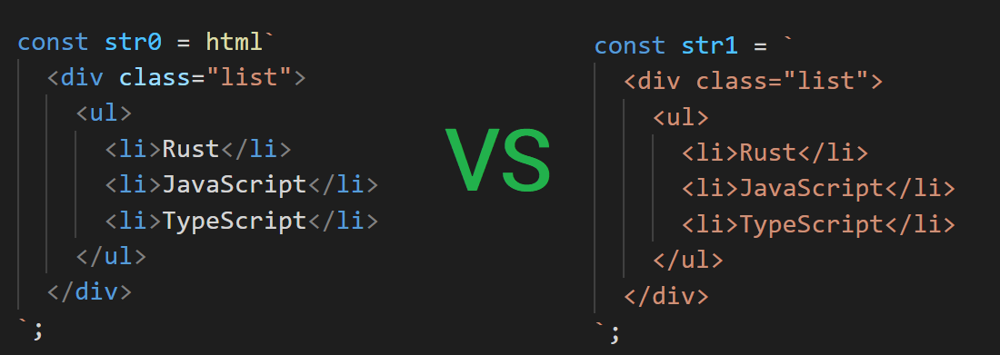

# deno_html

[](https://github.com/denomod/deno_html/releases)
[](https://github.com/denomod/deno_html/actions)
[](https://github.com/denomod/deno_html/blob/master/LICENSE)
[](https://github.com/denoland/deno)

Useful template literal tags for create html strings in ES2015+.

## Usage

```ts
import { html } from "https://deno.land/x/html/mod.ts";

let languages = ['Rust', 'JavaScript', 'TypeScript'];

const str = html`
  <div class="list">
    <ul>
      ${languages.map(x => `<li>${x}</li>`)}
    </ul>
  </div>
`;

console.log(str);
```

Outputs:

```html
<div class="list">
  <ul>
    <li>Rust</li>
    <li>JavaScript</li>
    <li>TypeScript</li>
  </ul>
</div>
```

## Why not template literal?



### License

[deno_html](https://github.com/denomod/deno_html) is released under the MIT License. See the bundled [LICENSE](./LICENSE) file for details.
